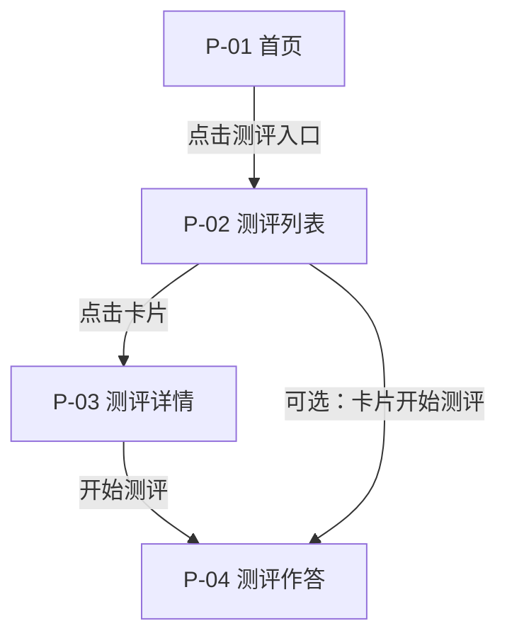
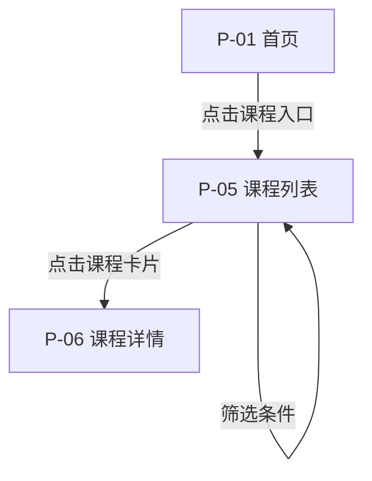
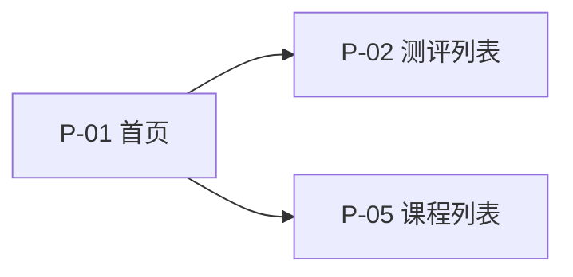

# 页面逻辑图：测评流程与课程流程

说明用户从进入到完成**第一周范围内核心操作**的页面跳转。与 [01-page-inventory.md](01-page-inventory.md) 路由一致。

**实现**：路径已在 [src/app/router.tsx](../../src/app/router.tsx) 落地；作答路由为独立顶层路由，不经过 `MainLayout`，与「作答页少干扰」一致。

---

## 测评流程（主路径 + 可选快捷）

**主路径（推荐）**：先读详情再作答，路径最清晰。

**步骤说明**

1. 首页进入测评列表。  
2. 在列表上通过分类缩小范围，点击某套测评卡片进入详情。  
3. 详情页阅读说明后点击「开始测评」进入作答页。  
4. **可选**：列表卡片提供「开始测评」，直达作答（与详情页主按钮一致，适合重复用户）。

**作答结束（占位）**：提交成功 → Toast 或简单成功态 → 返回测评列表或详情（具体以后端与产品规则为准）。

---

## 课程流程

**步骤说明**

1. 首页进入课程列表。  
2. 使用筛选缩小范围（第一周 Mock 数据即可）。  
3. 点击课程卡片进入详情，阅读完整信息与学习价值。  
4. 详情页主按钮（学习/报名等）第一周仅占位，不接真实业务。

---

## 全局导航关系（两模块与首页）

从测评分支与课程分支均可经顶栏或面包屑返回首页（第二周 UI 定具体组件；第一周逻辑允许 `Logo → 首页`、面包屑「首页」）。
